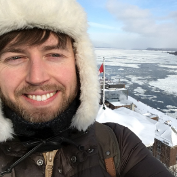

<link rel="stylesheet" type="text/css" href="main.css">

# Coleman Broaddus

Pfotenhauerstraße 108  
01307 Dresden

coleman.broaddus [at] gmail.com  
broaddus [at] mpi-cbg.de  
<a href="https://twitter.com/colemanb">@colemanb</a>  
[github.com/colemanbroad](https://www.github.com/colemanbroad)  
[google scholar](https://scholar.google.de/citations?user=Mg5hbr4AAAAJ&hl=en)  

I'm currently working towards a PhD in Computer Science at the [MPI-CBG]("https://www.mpi-cbg.de/home/") in the [Myers Lab](https://myerslab.mpi-cbg.de/) focusing on BioImage Analysis for developmental biology. 
I finished a masters in Nanobiophysics at the [BIOTEC](http://www.biotec.tu-dresden.de/teaching/masters-courses/nanobiophysics/) in Dresden in 2015, with a thesis supervised by [Frank Jülicher]("https://www.pks.mpg.de/biological-physics/frank-juelicher/). 
I've been in Dresden since 2010 after finishing an B.S. in Physics at Carnegie Mellon.

## Publications

Broaddus C, Weigert M, Schmidt U, Myers G. **Cell nuclei detection and segmentation from weak annotations.** ISBI 2019. (Submitted).  

Schmidt U, Weigert M, Broaddus C, Myers G. **Cell Detection with Star-convex Polygons.** MICCAI 2018.  

Weigert M, et al. **Content-aware image restoration: pushing the limits of fluorescence microscopy.** Nature Methods 15 (2018). 236463.  

Stapel LC, Broaddus C, Vastenhouw NL. **Detection and Automated Analysis of Single Transcripts at Subcellular Resolution in Zebrafish Embryos.** InRNA Detection 2018 (pp. 143-162). Humana Press, New York, NY.  

Stapel LC, Lombardot B, Broaddus C, Kainmueller D, Jug F, Myers EW, Vastenhouw NL. **Automated detection and quantification of single RNAs at cellular resolution in zebrafish embryos.** Development. 2016 Feb 1;143(3):540-6.  
